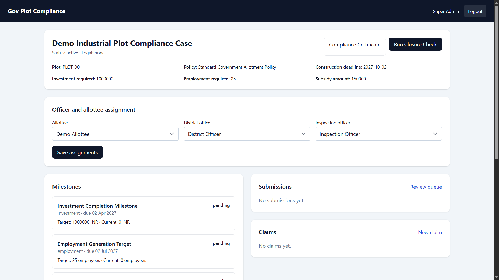
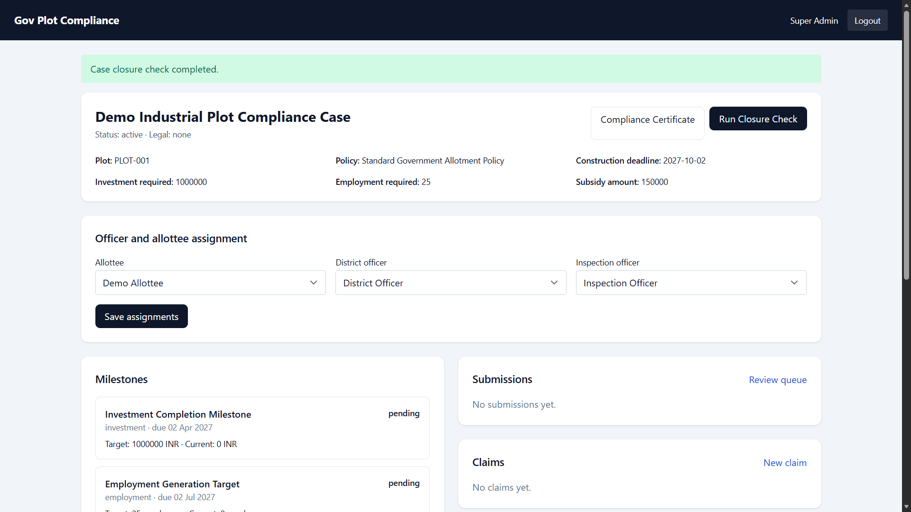

# Government Plot Compliance Management System

A Laravel-based workflow application for managing government plot allotments, policy milestones, evidence submissions, incentive claims, legal actions, audit events, and compliance reporting.

**Live Demo:** https://gov-plot-compliance.getvoroa.com/login

## Application Preview

### Compliance Case Dashboard



The case dashboard brings together plot details, policy requirements, officer/allottee assignments, compliance milestones, evidence submissions, and incentive claims.

### Case Closure Check



The application supports workflow actions such as case closure checks and provides visible completion feedback to authorized users.

## Overview

Government Plot Compliance is designed as a role-based compliance workflow application for tracking government plot allotment cases from assignment through milestone monitoring, evidence review, incentive claims, legal actions, and final compliance reporting.

The system organizes policy requirements into structured milestones and provides role-protected workflows for administrators, officers, and allottees.

## Core Workflow

The application supports the following workflow:

1. Configure policy templates and milestone rules.
2. Create and assign plot allotment cases.
3. Assign responsible officers and allottees.
4. Generate case timelines from policy milestones.
5. Track investment, employment, and other compliance requirements.
6. Collect evidence submissions for review.
7. Monitor milestone progress and compliance status.
8. Process incentive claims through role-based approvals.
9. Record legal notices, extensions, reviews, and terminations.
10. Run case closure checks.
11. Generate compliance certificates and reports.
12. Maintain an audit trail for material case actions.

## Key Capabilities

### Plot & Case Management

- Government plot allotment case tracking
- Policy-linked compliance requirements
- Case status management
- Construction and compliance deadlines
- Investment and employment targets
- Subsidy and incentive information
- Officer and allottee assignments

### Policy & Milestones

- Configurable policy templates
- Milestone-based compliance tracking
- Investment completion milestones
- Employment generation targets
- Due-date monitoring
- Current-versus-target progress tracking
- Compliance status evaluation

### Evidence & Review

- Evidence submission workflows
- Submission review queues
- Role-protected review actions
- Case-level compliance evidence tracking

### Incentive Claims

- Incentive claim creation
- Role-based approval workflows
- Claim status tracking
- Case-linked incentive processing

### Legal Actions

- Legal notice records
- Extension tracking
- Legal reviews
- Termination records
- Case-level legal status

### Reporting

The application supports generation of compliance-related documents and reports, including:

- Monthly reports
- Non-compliance reports
- Case certificates
- Compliance certificates

### Audit Trail

Material case actions are recorded through an audit trail to support accountability and operational review.

## Roles & Authorization

The application uses role-based route protection for:

- **Super Administrators**
- **State Administrators**
- **District Officers**
- **Inspection Officers**
- **Allottees**

Authorization is enforced at route-group boundaries and should be reviewed together with the application's business rules before production deployment.

## Technology Stack

| Layer | Technology |
|---|---|
| Backend | PHP 8.2+ |
| Framework | Laravel 12 |
| Database | MongoDB |
| MongoDB Integration | `mongodb/laravel-mongodb` |
| Authorization | Spatie Laravel Permission |
| Frontend | Blade |
| Styling | Tailwind CSS |
| JavaScript | Alpine.js |
| Build Tool | Vite |
| PDF Generation | Dompdf |
| Testing | PHPUnit |

## Application Architecture

The application follows a Laravel-based server-rendered architecture:

```text
Browser
   │
   ▼
Laravel Routes
   │
   ├── Authentication & Authorization
   │
   ├── Case Management
   │
   ├── Policy & Milestone Workflows
   │
   ├── Evidence & Review
   │
   ├── Incentive Claims
   │
   ├── Legal Actions
   │
   ├── Reporting & PDF Generation
   │
   └── Audit Events
   │
   ▼
MongoDB
